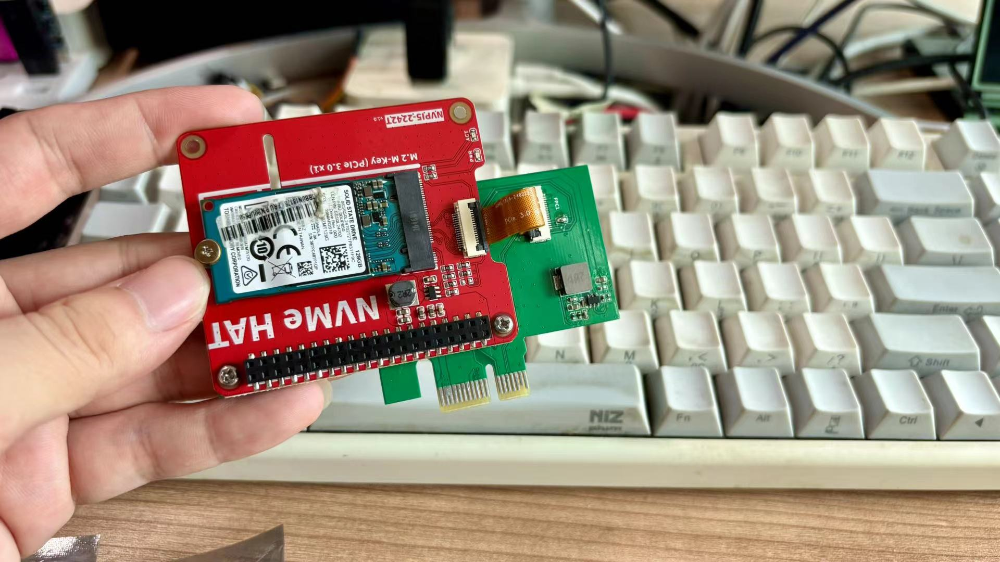
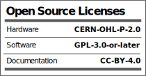

# open-HAT-PCIe
A open source boring board, converting the Pi's PCIe HAT into a PCIe x1 card. 

I have too many Raspberry Pi hats. Occasionally, I wish to debug them on an x86 computer, which gave birth to the idea of creating an adapter board. Thus, the **open HAT-PCIe** was born.

## OSHWA

## SCH

## PCB

